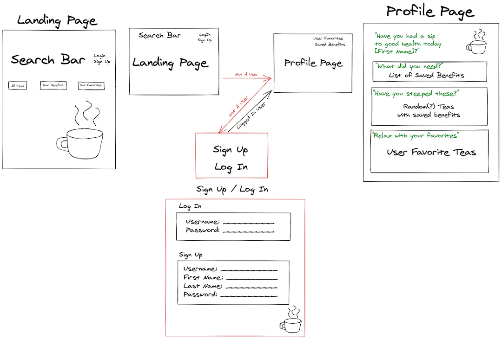
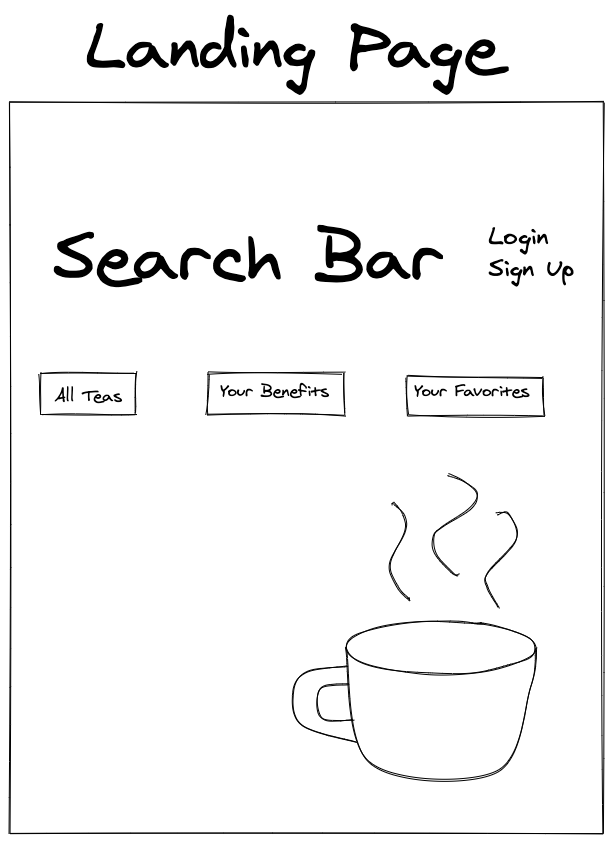
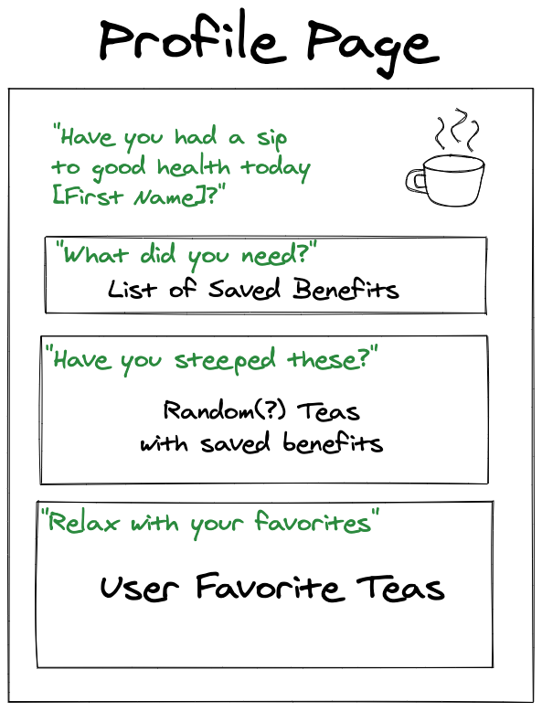
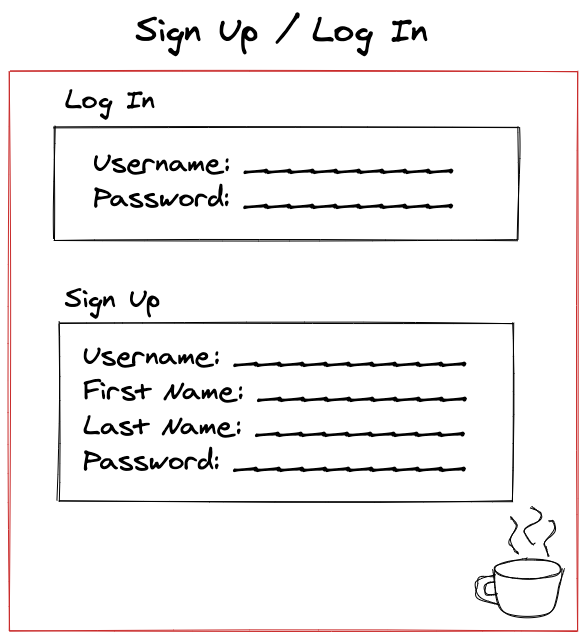
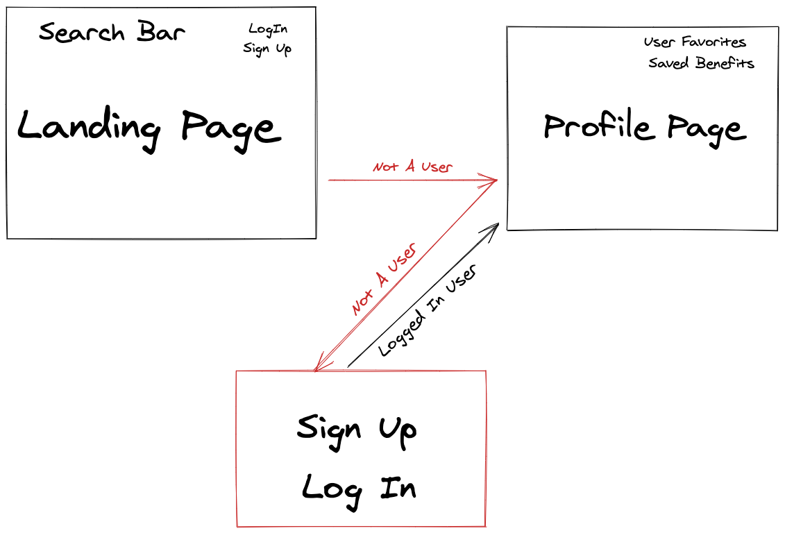
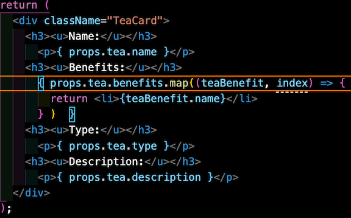

# Soul Sip'n
When people think of teas, they tend to think of "black tea", "green tea", "herbal tea", etc., but not many people tend to think of the specific _types_ of teas. For instance, "Matcha Tea" is a specific _type_ of Japanese green tea that is ceremoniously whisked into a frothy brew.

Also, tea is very beneficial to your health. Depending on the type of tea your soul wants to sip, your body gets different types of benefits. If you wanted to narrow your searches with remedies for certain ailments, then you can filter your search to your specific needs.

There's so much more to tea than people think and with Soul Sip'n you, as a user, are able to explore the wide variety of teas and improve your knowledge on the **brew**tiful world of tea.

## Motivation
For this project, the team wanted to go with something that users can benefit from and use on more than one occasion.

## User Stories
- As a user, I want to feel relaxed as I use this app.
- As a user, I want to sign up for 'soul sip'n"
- As a user, I want to view all teas.
- As a visitor, I want to be able to browse teas and benefits.
- As a logged in user, I want to add my favorite teas to a list.(STRETCH)
- As a logged in user, I want to save necessary benefits specific to me.
- As a logged in user, I want to be able to access my favorites list(STRETCH)
- As a logged in user, I want to be able to view my saved benefits

## Technologies Used
For Soul Sip'n we used many different technologies.
- Postgres
- Express
- React
- Node.js
- React-Strap
- SASS

## Wireframing / Pre-Code Planning

## Unsolved Problems
The team had a lot of blockers while making this app. The databases were one of the hardest hurdles to overcome. With the confusing one to many and many to many relationships about the many teas and the many benefits, databases were created and dropped many times. Thankfully, Lauren and Brock were able to create the perfect database for all the tea and benefit info.

Another blocker the team had was connecting the front-end to the back-end. This was the first project where the team had to create two separate repos, one for front-end and one for back-end. In the past, the repos would heavily lean towards one end, but this was the first time where it is equally balanced. The team was able to overcome this blocker with the help of TA's and instructors.

A big blocker for the team was displaying the the different "Benefits" onto the individual tea cards. The tea information and the benefit information are stored in 2 separate databases. Connecting them onto a single page was something the team had never done before. After a lot of paired programming and help with a TA, the blocker was finally overcome with very satisfying results.

## Code Snippets
Throughout the journey of making this app come to life, the team had created code they they would like to show. This is code that either overcame blockers, code that they were proud of, or code they felt should be noted.

This code is the snippet of code on the "TeaCard" page. It shows the solution to our blocker of having to display two databases on one page.

## Future Enhancements
For this project we had a few plans that we didn't quite get to. With the time alloted we just weren't able to implement those features into the final product, but we hope to include them with future updates. Here is what we had in mind.
- Allowing the logged in user to favorite 
- Theme changes based on the type of tea the user is reading on.

## Special Thanks To...
Without these people, the app would not be where it is today!

Instructors and TAs
- Brock Whitbread-Cole
- James Sinkler
- Jacob Kleiman
- Seanny Phoenix